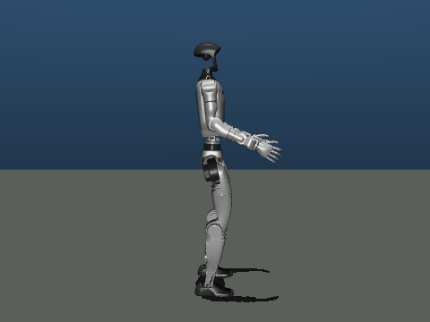

# robot-rl-lab

机器人强化学习全栈框架：MuJoCo 仿真 → 从零实现的 PPO/SAC → ONNX 导出与 INT8 量化 → 端侧部署回测。

以 Unitree G1 / H1 / Go2 三种形态为演示，重点在**闭环完整**与**每一层都能讲清楚**。

```
训练 ──▶ 策略 ──▶ ONNX ──▶ INT8 ──▶ 延迟基准 ──▶ 仿真回测
 │        │        │        │          │            │
 └ 仿真环境 └ 自写算法 └ 自包含图 └ 量化   └ p50/p95/p99 └ 奖励/动作偏差
```



G1 速度跟踪，用仓库自带的最小预设训出来的策略：站住约 1.6 秒后仰面摔倒。
这个回放本身就是一句实话——**仓库里没有"会走的机器人"**，原因见下表。

## 当前状态

这个仓库要解决的是"链路完整、每一层可解释"，不是"训出一个能上机器人的控制器"。
哪些验证过、哪些只跑通、哪些没做，一次说清：

| 部分 | 状态 | 说明 |
| --- | --- | --- |
| 训练 → 导出 → 量化 → 基准 → 回测 | 已验证 | toy 任务（不依赖 MuJoCo）分钟级跑通；CI 每次都跑这 412 个用例 |
| PPO / SAC 从零实现 | 已验证 | 49 个用例，覆盖 GAE、比率裁剪、tanh 修正、目标网络、熵温度 |
| G1 / H1 / Go2 三形态 | 已验证 | 换 `env.robot` 一个字段；地形采样与关节映射都有测试守着 |
| 量化回测与 KL 阈值 | 已验证 | 20 回合配对回测，动作分布偏了就明确报错，而不是照样给个结论 |
| G1 速度跟踪策略 | 仅冒烟 | 8448 步、约 7 秒训出来的；**下面所有数字都出自它** |
| 仓库自带的正式预设 | 未跑 | G1 PPO 2000 万步 / 64 环境，Go2 SAC 3000 万步 / 32 环境。纯 CPU 上是小时级，本仓库的数字不是它们跑出来的 |
| 崎岖地形 / 楼梯 | 只到环境 | 地形生成与采样有测试；没有训练到收敛的策略 |
| 真机 / NPU 部署 | 未做 | 只到 ONNX + INT8 + 仿真回测。`PolicyEngine.register_backend` 留了后端接口，没有实现 |

两个数字要连起来看：**8448 步不是 2000 万步**。下面那些性能数字证明的是链路可复现，
不是策略性能。

## 这个项目解决什么

机器人强化学习的开源项目大多停在"导出 ONNX"这一步。量化之后精度掉多少、
延迟降多少、策略行为偏了多少——这些端侧部署必须回答的问题，很少见到公开的
对照数据。本项目把这条链补完：量化前后在同一批初始状态下跑完整回合，给出
奖励差、动作偏差和延迟分布的对照，并且这套流程与具体硬件解耦。

框架本身不绑机器人。换形态只需改配置里的一个字符串，新增一种形态只需加一份
形态定义。这一点在本项目的三足式形态上验证，也为无人机、车辆等非足式形态预留
了接口。

## 特性

- **从零实现 PPO 与 SAC**，分别 294 行和 260 行（含注释），不含任何 RL 库。超参
  对齐论文与主流实现，实现细节逐条注释。
- **跨形态**：G1（29 自由度人形）、H1（19 自由度人形）、Go2（12 自由度四足）
  共用同一套环境、算法与部署管线，切换只改 `env.robot`。
- **自包含 ONNX**：观测归一化写进计算图，推理端直接喂原始观测，无需预处理代码。
- **量化回测闭环**：导出 → 等价校验 → INT8 量化 → 延迟基准 → 仿真回测，
  每步都有可复现的对照数据。
- **中文体系化文档**：两条阅读路线，一条面向有 ML 背景的读者，一条从零开始。

## 快速开始

分两条路。第一条不下载模型，两三分钟跑完；第二条要用真实的机器人模型。

### 路径一：不下载模型，跑通全链路

```bash
git clone https://github.com/Qxy661/robot-rl-lab.git && cd robot-rl-lab
pip install -e ".[dev]"

python examples/toy_train.py
```

toy 是质点速度跟踪任务，不依赖 MuJoCo，几十秒内就能训练到明显的策略提升，
然后把导出、量化、基准、回测整条链走一遍。它的作用是让你在改完任何一层之后，
能立刻确认链路还是通的。

### 路径二：真实机器人

```bash
pip install -e ".[deploy,dev]"
python scripts/fetch_assets.py     # MuJoCo Menagerie 的稀疏检出，只取用到的三个
```

复现下面那张表（训练约 7 秒，整条链几分钟）：

```bash
python scripts/train.py     --config robotrl/configs/train/g1_smoke.yaml
python scripts/export.py    --run-dir runs/g1_smoke
python scripts/quantize.py  --run-dir runs/g1_smoke --mode dynamic
python scripts/quantize.py  --run-dir runs/g1_smoke --mode static
python scripts/benchmark.py --run-dir runs/g1_smoke --mode dynamic
python scripts/benchmark.py --run-dir runs/g1_smoke --mode static
python scripts/evaluate.py  --run-dir runs/g1_smoke --mode dynamic
python scripts/evaluate.py  --run-dir runs/g1_smoke --mode static
```

看策略跑（开窗口，按实时节奏播），或者录成 GIF：

```bash
python scripts/play.py --run-dir runs/g1_smoke
python scripts/play.py --run-dir runs/g1_smoke --record docs/assets/g1_velocity.gif
```

真要看策略训成什么样，得跑正式预设（纯 CPU 上是小时级）：

```bash
python scripts/train.py --config robotrl/configs/train/g1_velocity.yaml
```

## 项目结构

```
robotrl/
  assets/      物理层：RobotSpec 形态定义 + MuJoCo 模型加载
  envs/        环境层：8 段管线（动作/仿真/终止/奖励/复位/指令/随机化/观测）
  algorithms/  算法层：PPO 与 SAC，网络/存储/算法/训练循环四件套正交
  deploy/      部署层：导出、等价校验、量化、基准、回测、推理后端
  eval/        评估层：固定种子的可复现基准
  configs/     配置模式与预设
docs/          中文文档，两条阅读路线
```

四个契约把各层隔开，改一层不影响其他层：

| 契约 | 位置 | 作用 |
| --- | --- | --- |
| `RobotSpec` | `assets/spec.py` | 机器人有哪些关节、默认姿态、PD 增益 |
| `BaseEnv` | `envs/base_env.py` | 环境对外接口，8 段管线的执行顺序 |
| `Policy` / `Trainer` | `algorithms/base.py` | 观测到动作的映射、训练与评估接口 |
| 观测/动作维度 | `contracts.py` | 各层共用的观测布局与动作语义 |

## 想改哪里，读哪个文件

| 想做的事 | 从哪读起 |
| --- | --- |
| 换一种机器人 | `assets/spec.py`，三份形态定义在同目录；加载走 `envs/mujoco_env.py` |
| 改奖励 | `envs/tasks/velocity.py` 是任务默认权重，配置里的 `reward.scales` 覆盖它 |
| 改观测 | `contracts.py` 定布局，`envs/base_env.py` 的 `_observe` 负责拼 |
| 加一种地形 | `envs/terrain.py`，加一个 builder 并在配置里写名字 |
| 加域随机化 | `envs/events.py`，一个事件一个类，注册后在配置里挂参数 |
| 读 PPO / SAC | `algorithms/ppo.py`（294 行）/ `sac.py`（260 行） |
| 看训练循环 | `algorithms/trainer.py`，评估、存档、日志都在这里 |
| 读环境循环 | `envs/base_env.py` 的 `step`，8 段管线的顺序 |
| 导出 ONNX | `deploy/export_onnx.py`；等价校验在 `deploy/equivalence.py` |
| 量化 | `deploy/quantize.py`，动态与静态两种 |
| 测延迟 | `deploy/benchmark.py`；先读 `utils/cpu_affinity.py`，绑核是前提 |
| 量化回测 | `deploy/evaluate.py`，三个指标各自的取法 |
| 换推理后端 | `deploy/engine.py` 的 `register_backend` |
| 加一种新形态 | `docs/05_跨形态抽象.md` 有完整的三步，环境层与算法层不用动 |

## 文档

面向零基础读者的入门路线：

| 章节 | 主题 |
| --- | --- |
| [00](docs/00_背景知识.md) | Python 与 NumPy，读代码需要的最小集 |
| [01](docs/01_神经网络与PyTorch.md) | 前向、反向、梯度与训练循环 |
| [02](docs/02_强化学习基础.md) | 环境、奖励、策略，以及那个 50Hz 的循环 |
| [03](docs/03_物理仿真与机器人.md) | 关节、电机、PD 控制与 MuJoCo |
| [04](docs/04_PPO与SAC.md) | 先讲思路，再对着代码讲实现 |
| [05](docs/05_跨形态抽象.md) | 换一份配置换一个机器人 |
| [06](docs/06_部署与量化.md) | 从 ONNX 到端侧，以及量化回测 |
| [07](docs/07_未决问题与风险.md) | 已知的坑、还没做的事，按严重程度排 |

面向有 ML 背景读者的模块文档在 `docs/` 下同目录，按模块命名。

## 基准结果

以下数字全部由上面那组命令生成（G1 速度跟踪，15 个受控关节，观测 57 维，
20 回合配对回测）。报告不入库（`runs/` 太大且可重新生成），跑一遍就有。

和同类项目比之前先看清一件事：这里的策略只训了 8448 步，它站得住 1.6 秒，
不会走。所以下面比的是**同一个策略的两份实现**，不是两个策略；绝对值不构成
任何性能声明。

### 端侧体积与延迟

| | FP32 | INT8 动态 | INT8 静态 |
| --- | --- | --- | --- |
| 文件体积 | 199.3 KB | 61.0 KB（**3.27×**） | 60.9 KB（**3.27×**） |
| min 延迟（1 线程 / batch 1） | 0.0099 ms | 0.0116 ms | 0.0118 ms |
| 加速比（按 min） | 1.00× | **0.85×** | **0.85×** |
| 仿真回测回报（20 回合） | 64.085 ± 16.665 | 64.032（−0.08%） | 64.020（−0.10%） |
| 逐维动作 MAE | — | 0.00093 | 0.00127 |
| 动作最大偏差 | — | 0.0070 | 0.0099 |
| 动作分布 KL（均值 / 最大维） | — | 0.0000 / 0.0000 | 0.0000 / 0.0000 |

测量环境：Intel Core Ultra 7 255H，onnxruntime CPU，单线程、batch 1，进程固定在
CPU1 上。

**结论要说清楚：在这颗 CPU 上，INT8 没有让这个小网络变快。** 两份量化模型的
min 延迟都比 FP32 高约 15%。量化真正拿到的是体积——3.27 倍，对端侧存储和
内存带宽是实打实的收益；而延迟收益要等 NPU 后端（`PolicyEngine.register_backend`
留的就是这个口子）。业界讲量化时常把"更快"当默认前提，这里给出的是量出来的结果。

动态和静态两种量化方式在这份模型上几乎没有区别：体积一样、延迟一样、回测回报
都在 0.1% 以内。选哪个都行，本项目默认用动态——它不依赖校准数据，少一个会
出错的环节。

### 这份延迟数字为什么可信

微秒级的推理基准很容易测出假结论。这个项目为此栽过跟头，所以下面每一条都有
对应的实现（`robotrl/deploy/benchmark.py` 与 `robotrl/utils/cpu_affinity.py`）：

- **先把进程绑到一个核上。** 这是最容易被忽略、影响却最大的一条。这台 CPU 是
  大小核混合架构，同一个模型、同一份输入，逐个逻辑核测最小延迟，最快 0.0100 ms、
  最慢 0.1097 ms——**差将近 8 倍**。不绑核时进程由调度器在核之间迁移，而待测的
  差异只有 15%，完全被淹掉：本项目在引入绑核之前，同一份模型先后测出过 0.86×
  和 1.24× 两个方向相反的加速比，当时以为是测量噪声，实际是进程换了核。
- **按 min 下结论，不按均值。** 干扰只会让一次测量变慢、不会变快，所以最小值
  最接近真实计算耗时。绑核后 FP32 的 min 稳定在 0.0099–0.0100 ms，而同一批
  测量的 p50 在 0.011–0.030 ms 之间跳。
- **配对测量。** 每轮交替测 FP32 和 INT8（而非测完一个再测另一个），两个模型
  落在同一段机器状态里。
- **波动超过差异时不下结论。** 各轮比值的最大/最小之比超过阈值时，报告直接写
  "本机分辨不出来"，而不是照样给一个两位小数的加速比。这台机器上装着一堆终端
  管控软件，后台负载一直在变，所以跑出来的报告**每一份都带着这条警告**——这不
  是缺陷，是它该做的：警告针对的是均值和 p99 那两列，本轮结论只取 min。

### 训练吞吐

同一份 G1 任务在纯 CPU 上：单环境每步约 1.5 ms，串行推进 64 个环境需要
96 ms/控制步；改成多进程整批下发后降到约 7 ms（**5.8×**）。

另外，PyTorch 的线程数默认设成 1 而不是核数——这个网络只有几万参数，算子被切到
多核后线程同步的开销超过省下的计算时间。16 核机器上一个 64×64 MLP 的 backward
走 16 线程要 258 ms，走单线程只要 0.92 ms（**280×**）。详见 `robotrl/utils/torch_runtime.py`。

## 引用与致谢

这个项目的价值在于把几件成熟的东西拼成一条完整的链，而不是重新发明它们。
依赖的每一个都是在自己位置上最合适的那个：

| 依赖 | 用途 | 许可 |
| --- | --- | --- |
| [MuJoCo](https://github.com/google-deepmind/mujoco) | 物理仿真与渲染 | Apache-2.0 |
| [MuJoCo Menagerie](https://github.com/google-deepmind/mujoco_menagerie) | G1 / H1 / Go2 的模型与场景 | BSD-3-Clause |
| [PyTorch](https://github.com/pytorch/pytorch) | 算法实现与训练 | BSD-3-Clause |
| [onnxruntime](https://github.com/microsoft/onnxruntime) | 端侧推理后端 | MIT |
| [Pillow](https://github.com/python-pillow/Pillow) | 回放录制 GIF | MIT-CMU |

其余是常规的 Python 库（NumPy、PyYAML、ONNX、pytest、ruff），没有需要特别说明的取舍。

算法侧对照了 [CleanRL](https://github.com/vwxyzjn/cleanrl)、
[rl_games](https://github.com/Denys88/rl_games) 与
[legged_gym](https://github.com/leggedrobotics/legged_gym) 的实现取舍，
超参取值以论文为准，代码是重写的。

## 许可

Apache-2.0。机器人模型来自 MuJoCo Menagerie（BSD-3-Clause），不随本仓库分发，
由 `scripts/fetch_assets.py` 拉取。
